# Adrian Damião

## Olá pessoal 👋
Gosto muito de estudar desenvolvimento web e também a área de redes de computadores. 
Atualmente trabalho como Desenvolvedor Fullstack Pleno para o [Grupo SOITIC](https://soitic.com.br). 👨‍💻

- 🌱 Atualmente estudando ASP.NET Core, C# e lendo o Clean Code (Cap°12). 
- :heavy_check_mark: Objetivo: Ser capaz de otimizar algo no ambiente em que vivo utilizando a computação. Update: Ajudar as pessoas a entenderem sobre programação 
- 💬 Sobre mim: Amante de tecnologias, jogos de FPS, aviação, gosto de falar para as pessoas sobre programação e sou admirador/apoiador da Polícia. :computer: :video_game: :airplane: :rotating_light:

a
  <a href="https://github.com/adriandamiao">
  
  

 </a>

 
  
  
  
  
  
  
  

 
 ##
 
 
 
  
 
  
 

 

